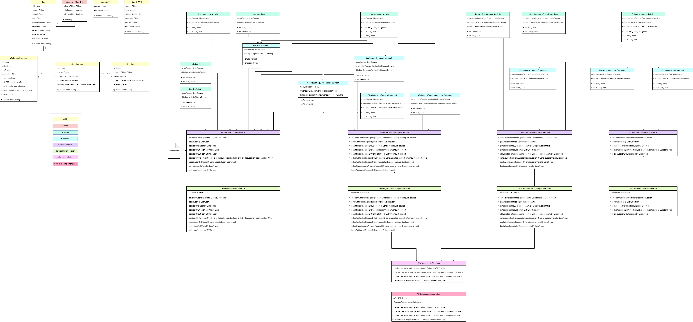
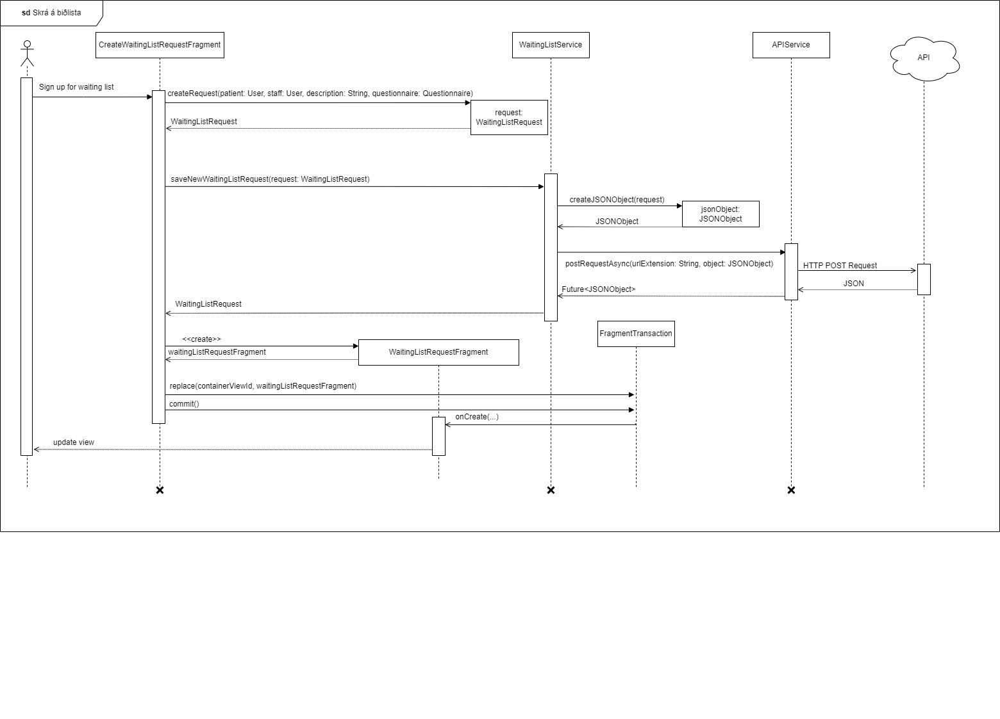
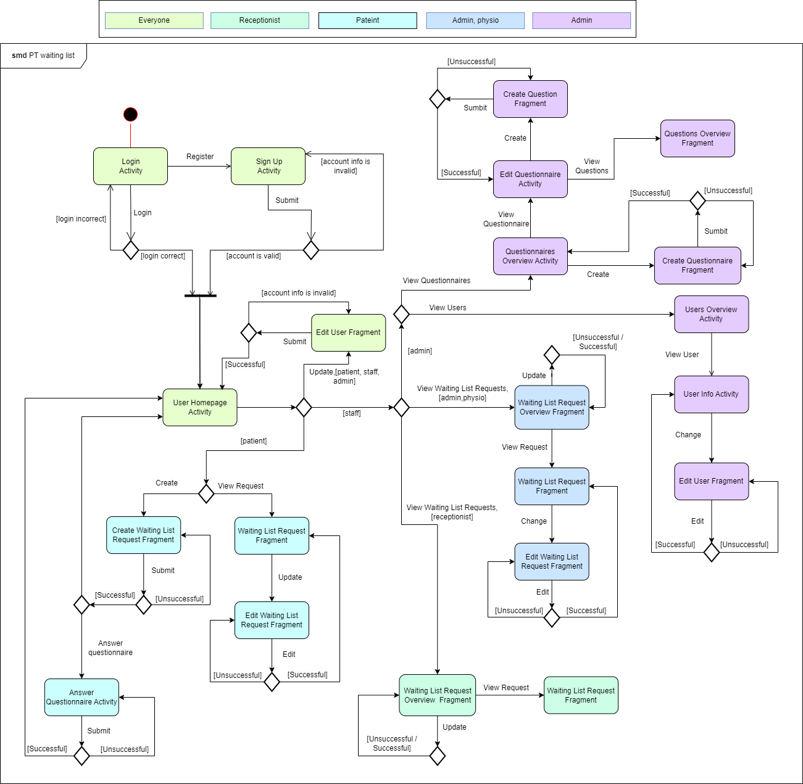

# Project UML Diagrams
### IMPORTANT: These diagrams are not kept up-to-date. Please refer to the source code for the most accurate information.

## Class Diagram

## Sequence Diagram

## State Machine Diagram

